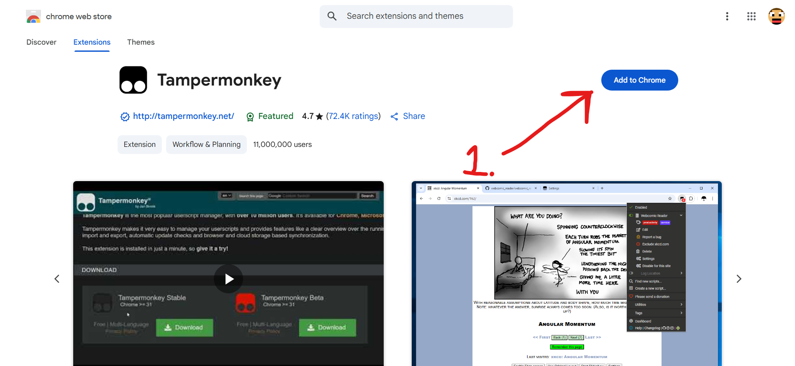
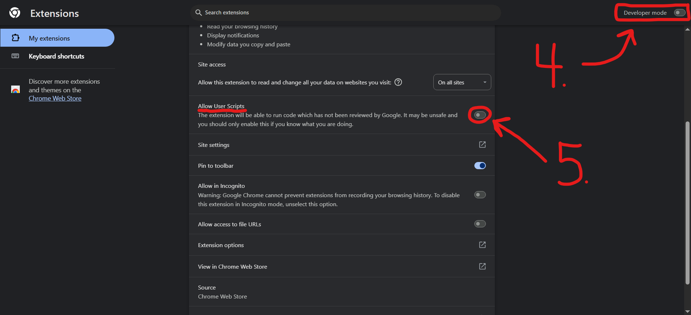
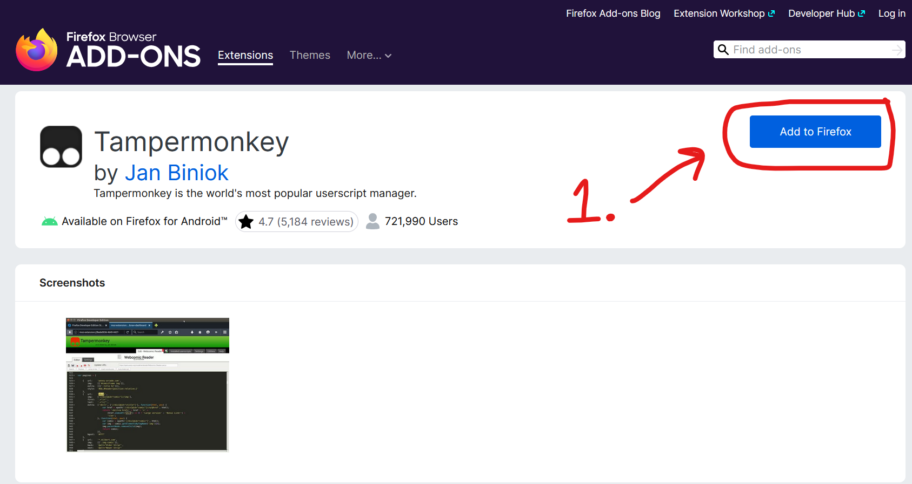
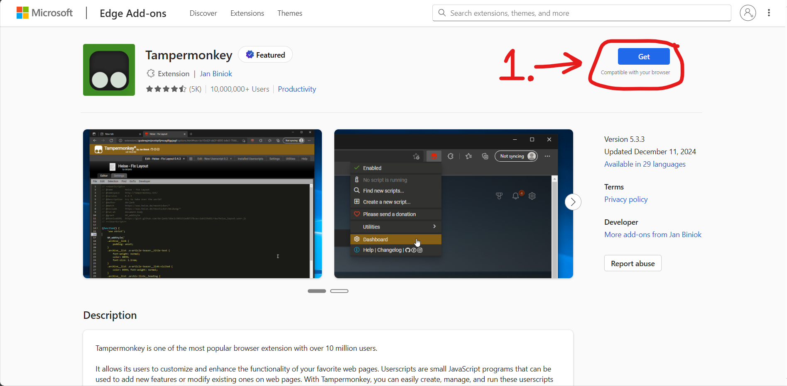
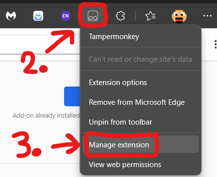
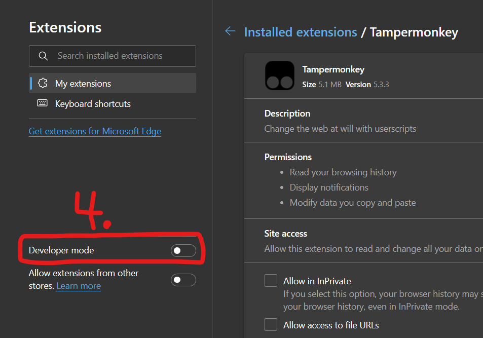

# How to install Tampermonkey?

Tampermonkey is a popular browser extension that allows you to install and manage userscripts. Here's how to install it on different browsers:

Chrome Installation Guide

1. Install the TamperMonkey extension from the [Chrome Web Store](https://chrome.google.com/webstore/detail/tampermonkey/dhdgffkkebhmkfjojejmpbldmpobfkfo)

   

2. Right-click the extension

   

3. Left-click "Manage Extension"
4. Enable "Developer Mode"

   

5. Enable "Allow user scripts"

Firefox Installation Guide

1. Install the TamperMonkey plugin from the [Firefox Add-ons page](https://addons.mozilla.org/en-US/firefox/addon/tampermonkey/)

   

Edge Installation Guide

1. Install the TamperMonkey plugin from [Edge Add-ons](https://microsoftedge.microsoft.com/addons/detail/tampermonkey/iikmkjmpaadaobahmlepeloendndfphd)

   

2. Right-click the extension

   

3. Left-click "Manage Extension"
4. Enable "Developer Mode"

   

After installation, you can verify it's working by clicking the Tampermonkey icon in your browser toolbar. You should see the Tampermonkey menu appear.
