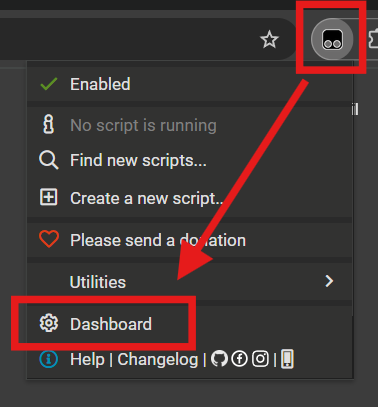
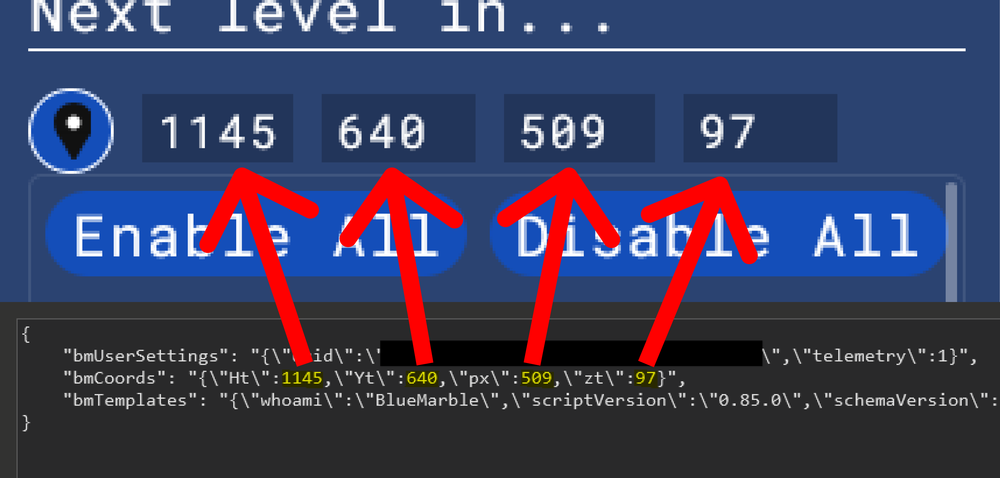
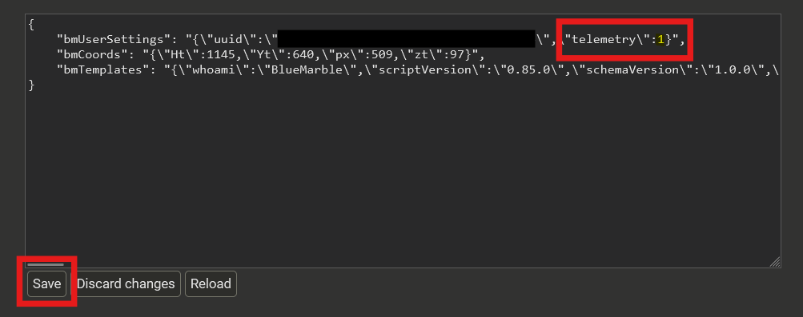

# Blue Marble
This page contains useful information about the [Blue Marble userscript](https://github.com/SwingTheVine/Wplace-BlueMarble):

import TOCInline from '@theme/TOCInline';

<TOCInline toc={toc} />

## How to install Blue Marble
Follow the installation steps on the official website:
https://bluemarble.lol/#install

## How to retrieve the coordinates for your template
### 1. Open the TamperMonkey dashboard
  
Example on Chrome

### 2. Enable Advanced config mode
Go to the Settings tab, and change the Config mode to Advanced in the General section (saves automatically when you change it)

### 3. Retrieve the coordinates
Go back to the Installed Userscripts and click on Blue Marble

Then click on the Storage tab

You should now see the coordinates:

If you want to delete it, replace the entire thing with `{}`, then click Save

## My template appears too big on the canvas
Use a color converter. You can find a list of them on the [Useful Tools & Resources page](/useful-tools)

## How to disable telemetry without reinstalling Blue Marble
### 1. Open the TamperMonkey dashboard
  
Example on Chrome

### 2. Enable Advanced config mode
Go to the Settings tab, and change the Config mode to Advanced in the General section (saves automatically when you change it)

### 3. Disable telemetry
Go back to the Installed Userscripts and click on Blue Marble

Then click on the Storage tab

Change the number next to `"telemetry\":` to `0`, and then click Save:

